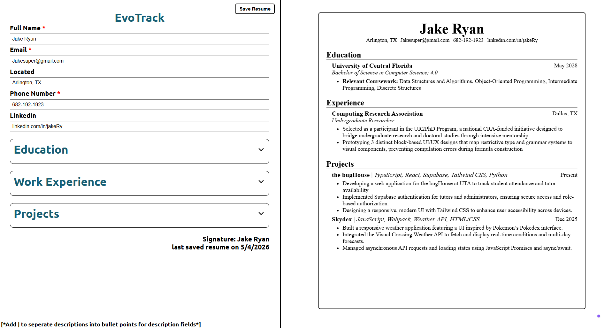
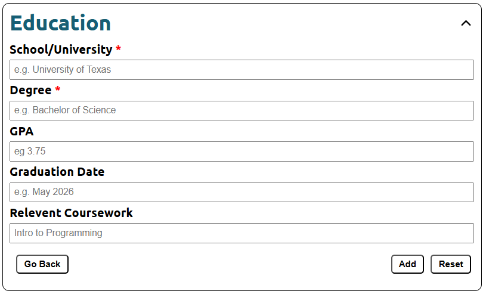
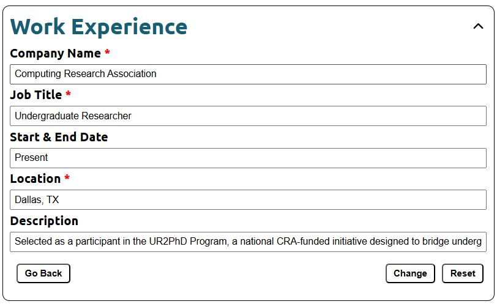
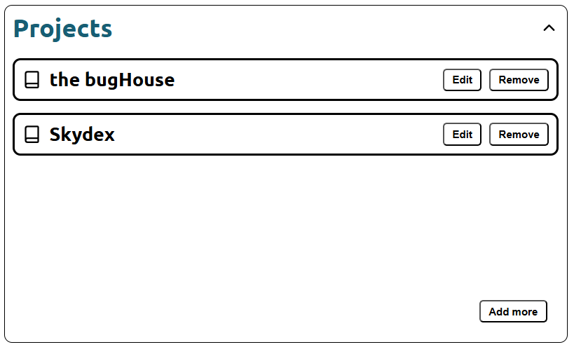

# EvoTrack


A dynamic resume builder following The Odin Project curriculum. EvoTrack focuses on React fundamentals like state management and props, while outputting resumes optimized for ATS systems.


## 1. Key Features

- **Real-time Editing:** See your CV update instantly as you type.
- **ATS Format:** Follows the Jake Resume Template online to maximize benefits
- **Responsive Design:** Fully optimized for mobile and desktop viewing.
- **Local Storage:** Save your resume to see your progression as you improve it

## 2. Pictures

### Main Screen



### Adding Screen



### Editing Screen



### Viewing entries Screen



## 3. Project Structure

```text
CV_application
├── README.md
├── eslint.config.js
├── index.html
├── package-lock.json
├── package.json
├── public
├── src
├── public/                # Static assets and screenshots
├── src/
│   ├── components/        # Reusable UI components
│   ├── data/              # Default resume data/logic
│   ├── styles/            # CSS files
│   ├── App.jsx            # Application entry point
|   ├── Main.jsx
│   └── Resume.jsx         # Main resume rendering logic
└── vite.config.js
```

## 4. Installation & Setup

### Before You Start — Install These Once

If you don't have these already, install them first:

- **Git** — https://git-scm.com/downloads
- **Node.js 18+** — https://nodejs.org (choose the LTS version)

To check if you have them, run:

```bash
git --version
node --version
```

---

### Step 1 — Clone the Repo

```bash
git clone https://github.com/AndyKhandy/CV_application.git
cd CV_application
```

### Step 2 — Run the repo

```bash
npm install
npm run dev
```

You should see something like:

```
  VITE v5.x.x  ready in ...ms
  ➜  Local:   http://localhost:5173/
```

Open **http://localhost:5173** in your browser

## 5. What I learned
* **Lifting State:** understanding the flow of data by lifting state from child components to a common parent to keep UI synced.
* **Explicity Return:** If using curly braces in an arrow function, you explicitly need to call return in ES6
* **Conditional Rendering:** Implementing dynamic UI logic to show/hide editing forms.

## 6. Future features to Add

- **PDF Feature:** Save to PDF capability so users can use a downloadable resume (react-to-print package)
- **Scoring System:** Metrics to determine resume score from 0-5 stars based on depth of resume and utilization of all sections
- **Extra sections:** Highlight technical skills, leaderships, and certifications on the resume

[Attribution for Favicon](https://www.vecteezy.com/free-png/level-up)
